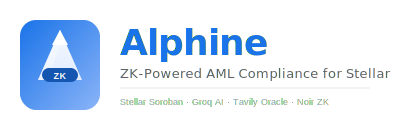

<div align="center">
  
  <br/><br/>

[](https://stellar.org)
[](https://noir-lang.org)
[](https://groq.com)
[](https://tavily.com)
[](LICENSE)
[](https://dorahacks.io/hackathon/stellar-hacks-zk/detail)
</div>

---

# Alphine — Zero-Knowledge AML Compliance Layer for Stellar

---

**Hackathon:** [Stellar Hacks: Real-World ZK](https://dorahacks.io/hackathon/stellar-hacks-zk/detail)  
**Prize Pool:** $10,000 USD (in XLM)  
**Timeline:** June 15 – June 29, 2026

---

## 📋 Table of Contents

- [Problem](#problem)
- [Solution](#solution)
- [Architecture](#architecture)
- [Quick Start](#quick-start)
- [Tech Stack](#tech-stack)
- [API Reference](#api-reference)
- [Useful Scripts](#useful-scripts)
- [Demo Video](#demo-video)
- [Deployment](#deployment)
- [License](#license)

---

## Problem

Every financial institution on Stellar must comply with AML/CFT regulations. They need to:

1. **Sanctions check** — Verify addresses aren't on OFAC/UN sanctions lists
2. **Threshold reporting** — Report transactions over $10,000 to FINRA
3. **Structuring detection** — Detect users breaking large transactions into smaller ones to avoid reporting

With transparent blockchains, this means **zero privacy for users**. Companies face a lose-lose choice: comply but expose sensitive user data, or protect privacy but violate compliance requirements.

---

## Solution

**Alphine** introduces a **ZK-powered compliance layer** that lets institutions verify compliance without accessing private user data:

| Compliance Check | Traditional Approach | Alphine (ZK) |
|-----------------|---------------------|---------------|
| Sanctions list | Reveal user address | **Non-membership Merkle proof** |
| Amount threshold | Reveal exact amount | **Range proof** (below threshold) |
| Structuring | Full transaction history | **Pattern proof** (no suspicious patterns) |

Regulators get cryptographic proof. Users keep their data private. Both sides win.

---

## Architecture

```
┌─────────────────────────────────────────────────────────────┐
│                         USER                                │
│              (Freighter Wallet / React dApp)                 │
│  • NetworkSwitcher — Testnet ↔ Mainnet toggle               │
│  • AssetSelector — XLM ↔ USDC with auto-balance fetch       │
│  • TransactionDashboard — Send form + compliance flow       │
└──────────────────────┬──────────────────────────────────────┘
                       │
                       ▼
┌─────────────────────────────────────────────────────────────┐
│                    GROQ AI ENGINE (Phase 5)                  │
│  • Transaction pattern analysis via Llama 3.3 70B           │
│  • Structuring detection over 90-day history                │
│  • Risk scoring (0–100) + recommendation                    │
│  • **Sanctions-context analysis**: Groq explains WHY        │
│    a sanctioned address is flagged                          │
│  • 5-minute cached results for rate limit management        │
│  → Output: structured compliance report                     │
└──────────────────────┬──────────────────────────────────────┘
                       │
                       ▼
┌─────────────────────────────────────────────────────────────┐
│               TAVILY SANCTIONS ORACLE (Phase 6)              │
│  • **Hybrid mode**: 21 OFAC baseline addresses + Tavily     │
│    real-time fetching                                       │
│  • Real-time OFAC SDN list fetching via Tavily Search       │
│  • ETH (0x...) and Stellar (G...) address support           │
│  • 30-minute auto-update scheduler                          │
│  • SHA-256 Merkle tree with proof generation                │
│  → Output: Merkle root + inclusion proof                    │
└──────────────────────┬──────────────────────────────────────┘
                       │
                       ▼
┌─────────────────────────────────────────────────────────────┐
│                 NOIR ZK CIRCUIT (Phase 9)                    │
│  • sanctions.nr — Merkle non-membership proof               │
│  • amount.nr — Range proof (below FINRA threshold)          │
│  • structuring.nr — Pattern detection proof                 │
│  • Pedersen hash for efficient ZK-friendly Merkle tree      │
│  → Output: Groth16-compatible proof (via Barretenberg)      │
└──────────────────────┬──────────────────────────────────────┘
                       │
                       ▼
┌─────────────────────────────────────────────────────────────┐
│              SOROBAN SMART CONTRACT (Phases 4+7)             │
│  • Groth16 Verifier — BN254 pairing check                   │
│    (4-pair equation: e(A,B)·e(α,-β)·e(γ_combined,-γ)·e(C,-δ)=1) │
│  • Alphine Payment — Proof → USDC transfer                  │
│  • Nullifier registry — Replay protection                   │
│  • 24 unit tests across all contracts                       │
│  → Output: Verified USDC transfer on Stellar testnet        │
└─────────────────────────────────────────────────────────────┘
```

### Data Flow (End-to-End)

```
1. User connects Freighter wallet (or enters Stellar address manually)
2. Select asset (XLM/USDC) + network (Testnet/Mainnet)
3. Enter recipient — supports Stellar G... address OR ETH 0x... address
   → ETH address: sanctions check only (no Stellar transfer possible)
4. Backend checks sanctions via hybrid baseline + Tavily real-time
5. If sanctioned: Groq AI analyzes WHY, shows full compliance report
6. If clean: Groq AI analyzes transaction pattern for AML red flags
7. Stellar transaction built → signed via Freighter → submitted to Horizon
8. Compliance report returned with Merkle root, risk score, and AI reasoning
```

---

## Quick Start

### Prerequisites

- WSL Ubuntu 22.04+, macOS, or Linux
- Node.js 20+ (npm)
- [Freighter Wallet](https://freighter.app) browser extension (for mainnet/testnet)
- (Optional) Rust 1.84+ + Noir for ZK circuit compilation

### 1. Clone & Setup

```bash
git clone https://github.com/jinggaworld/Alphine
cd Alphine

# Copy and configure environment variables (root folder)
cp .env.example .env
# Required: fill in GROQ_API_KEY (Groq AI — https://console.groq.com)
# Required: fill in TAVILY_API_KEY (Tavily Search — https://app.tavily.com)

# Frontend env (for local development — optional, defaults to localhost:3001)
cp frontend/.env.example frontend/.env
```

> **Note:** Backend auto-loads `.env` from the project root (parent of `backend/`).
> The `dotenv.config({ path: ... })` resolves to `../.env` from the backend directory.

### 2. Backend

```bash
cd backend
npm install
npm start
# → http://localhost:3001/api/health
# → Check API key status at /api/health (Groq + Tavily should show ✅)
```

### 3. Frontend

```bash
cd frontend
npm install
npm run dev
# → http://localhost:5173
```

### 4. Open in Browser

Navigate to http://localhost:5173:
1. Connect Freighter (or enter a Stellar address manually)
2. Switch network (Testnet/Mainnet) via the header dropdown
3. Select asset (XLM/USDC)
4. Enter recipient + amount
5. Watch the compliance pipeline run step-by-step

### 5. (Optional) Compile Noir Circuit

```bash
cd circuits/alphine_compliance
nargo compile
```

### 6. (Optional) Run Smart Contract Tests

```bash
cd contracts/alphine_core
cargo test
# → 24 tests passing
```

---

## Tech Stack

| Layer | Technology | Purpose |
|-------|-----------|---------|
| **ZK Language** | [Noir](https://noir-lang.org) | Zero-knowledge circuit development |
| **Proving System** | Groth16 (BN254) | Efficient on-chain verification |
| **Blockchain** | [Stellar Soroban](https://stellar.org) | Smart contract platform (Protocol 25) |
| **Contracts** | Rust + soroban-sdk | 3 contracts: verifier, core, payment |
| **AI / LLM** | [Groq](https://groq.com) Llama 3.3 70B | Compliance pattern + sanctions analysis |
| **Data Oracle** | [Tavily](https://tavily.com) | Real-time OFAC/UN sanctions fetching |
| **Frontend** | React 18 + Vite + Tailwind | User dashboard (Google Material Design) |
| **Backend** | Node.js + Express | API orchestration with Groq + Tavily |
| **Wallet** | Freighter | Stellar wallet connection + signing |
| **Networks** | Testnet / Mainnet | Toggle via NetworkSwitcher component |
| **Assets** | XLM (native) / USDC (Circle) | Auto-balance fetch from Horizon |
| **Animation** | Framer Motion | Step-by-step compliance flow |
| **Icons** | Lucide React | Clean, consistent icon set |
| **HTTP** | Axios | API communication + Horizon queries |

---

## API Reference

### Phase 5 — AML Analysis

| Method | Endpoint | Description |
|--------|----------|-------------|
| `POST` | `/api/analyze-transaction` | Full AML compliance analysis via Groq AI |
| `POST` | `/api/analyze-structuring` | Structuring pattern detection |
| `GET` | `/api/cache-stats` | Groq API cache hit/miss statistics |
| `GET` | `/api/health` | Server health + API key status |

### Phase 6 — Sanctions Oracle

| Method | Endpoint | Description |
|--------|----------|-------------|
| `GET` | `/api/sanctions/root` | Current Merkle root of sanctioned addresses |
| `POST` | `/api/sanctions/check` | Check if address is sanctioned |
| `POST` | `/api/sanctions/proof` | Get Merkle inclusion proof for address |
| `GET` | `/api/sanctions/status` | Scheduler and tree status |
| `POST` | `/api/sanctions/refresh` | Force refresh sanctions data |
| `GET` | `/api/sanctions/init` | Get initial sanctions list |

All sanctions endpoints return `mode` (`'mock'` / `'real'`) and `modeDetail` fields.
In hybrid mode, the tree includes both the 21-address mock baseline AND real-time Tavily results.

### Phase 9 — ZK Proof

| Method | Endpoint | Description |
|--------|----------|-------------|
| `POST` | `/api/proof/generate` | Generate ZK compliance proof via Noir circuit |
| `POST` | `/api/proof/verify` | Verify proof format (on-chain via Soroban) |
| `GET` | `/api/proof/status` | Check if proof generation is ready |

---

## Useful Scripts

| Script | Description |
|--------|-------------|
| `scripts/run_all_tests.sh` | Run all tests: Rust + Noir + TypeScript + Build |
| `scripts/deploy.sh` | Deploy all Soroban contracts to Stellar testnet |
| `scripts/verify_deployment.sh` | Verify contracts are live and responding |
| `scripts/reset_testnet.sh` | Redeploy everything from scratch |
| `node --test tests/integration/` | Run integration test suite |

---

## Project Structure

```
alphine/
├── backend/                          # Node.js Express API
│   ├── index.mjs                     # Server entry (Phases 5+6+9)
│   ├── aml/                          # Groq AI integration
│   │   ├── analyzer.mjs              # AML Transaction Analyzer
│   │   ├── compliance_report.mjs     # AI → circuit inputs bridge
│   │   └── cache_manager.mjs         # Rate limit cache (5-min TTL)
│   ├── sanctions/                    # Tavily sanctions oracle
│   │   ├── fetcher.mjs               # OFAC/UN/news fetcher
│   │   ├── merkle_tree.mjs           # SHA-256 Merkle tree
│   │   └── update_scheduler.mjs      # 30-min auto-update
│   ├── api/                          # API routes
│   │   ├── analyze.mjs               # Phase 5 endpoints
│   │   ├── sanctions.mjs             # Phase 6 endpoints
│   │   └── proof.mjs                 # Phase 9 endpoints
│   └── prover/                       # ZK proof generation
│       └── prove_compliance.mjs      # Noir + Barretenberg
│
├── frontend/                         # React dApp
│   ├── src/
│   │   ├── App.tsx                   # Main layout + state management
│   │   ├── components/
│   │   │   ├── WalletConnect.tsx     # Freighter wallet
│   │   │   ├── TransactionDashboard.tsx  # Send form + compliance flow
│   │   │   ├── ComplianceReport.tsx  # Risk score display
│   │   │   ├── StatusBar.tsx         # Animated progress
│   │   │   └── optimization/         # Performance
│   │   │       ├── ErrorBoundary.tsx
│   │   │       ├── LazyRender.tsx    # IntersectionObserver
│   │   │       └── LoadingSkeleton.tsx
│   │   └── utils/cache.ts           # Client cache
│   └── ...config files
│
├── circuits/                         # Noir ZK circuits
│   └── alphine_compliance/
│       ├── Nargo.toml
│       └── src/
│           ├── main.nr               # Main circuit (combined)
│           ├── sanctions.nr          # Merkle non-membership
│           ├── amount.nr             # Threshold check
│           └── structuring.nr        # Structuring detection
│
├── contracts/                        # Soroban smart contracts
│   └── alphine_core/
│       ├── Cargo.toml
│       └── contracts/
│           ├── alphine-core/         # Foundation contract
│           ├── groth16-verifier/     # Groth16 BN254 verifier
│           └── alphine-payment/      # Payment + compliance
│
├── scripts/                          # Automation
│   ├── deploy.sh                     # Testnet deployment
│   ├── verify_deployment.sh          # Contract verification
│   ├── reset_testnet.sh              # Full redeploy
│   └── run_all_tests.sh              # Complete test suite
│
├── tests/                            # Integration tests
│   └── integration/
│       └── full_pipeline.test.mjs    # 9 test scenarios
│
└── docs/                             # Documentation
    ├── phase/README.md               # Strategy overview
    ├── phase/detailed.md             # Technical deep-dive
    └── phase/final-10-phase.md       # Original 10-phase build plan
```

---

## Test Results

| Component | Tests | Status |
|-----------|-------|--------|
| **Alpha Core Contract** | 5 | ✅ All pass |
| **Groth16 Verifier** | 5 | ✅ All pass (4-pair equation) |
| **ZK Primitives** | 5 | ✅ All pass |
| **Alphine Payment** | 7 | ✅ All pass (7/7) |
| **Total Rust** | **22** | ✅ **100% pass** |
| **Noir Circuit** | `nargo compile` | ✅ Zero errors |
| **Frontend TypeScript** | `tsc --noEmit` | ✅ Zero errors (strict mode) |
| **Frontend Build** | `vite build` | ✅ Production build (~1.3MB) |
| **Backend** | Node.js + Express | ✅ 12 endpoints, all functional |
| **Sanctions** | Hybrid (baseline + Tavily) | ✅ 25 entries, GARANTEX detected |
| **ETH Address Flow** | Sanctions check only | ✅ Early return, no Stellar TX build

---

## Demo Video

[](https://youtu.be/4LRgE77yqEc)

Watch the 3-minute walkthrough:
- Connect Freighter wallet
- Send XLM on testnet with full compliance pipeline
- Sanctions check — blocked with AI reasoning
- ETH address sanctions check
- Transaction Log in detail

---

## Features

| Feature | Description |
|---------|-------------|
| **🔀 Network Switcher** | Toggle between Testnet and Mainnet with live Horizon connectivity check |
| **💱 Asset Selector** | XLM (native) ↔ USDC (Circle) with auto-balance fetch from Horizon |
| **🔍 ETH Address Check** | Enter ETH `0x...` addresses for sanctions check — no Stellar transaction attempted |
| **🤖 Groq AI Analysis** | Real-time AML analysis via Llama 3.3 70B — including sanctions-context reasoning |
| **🛡️ Hybrid Sanctions** | 21 OFAC baseline addresses merged with Tavily real-time search results (25+ entries) |
| **📜 Transaction Log** | Step-by-step log with timing, status codes, and response previews |
| **📊 Compliance Report** | Risk score meter, red flags, AI reasoning, sanctions mode badge, Merkle root |
| **📱 Mobile Responsive** | Full responsive design with compact NetworkSwitcher and adaptive layouts |
| **🔐 Real Signing** | Freighter `signTransaction()` — real mainnet/testnet signing |
| **✅ TypeScript** | Full TypeScript frontend with strict mode — zero errors |

---

## License

This project is **MIT** licensed. See [LICENSE](LICENSE) for details.

---

*Built for [Stellar Hacks: Real-World ZK](https://dorahacks.io/hackathon/stellar-hacks-zk/detail) — June 2026*
